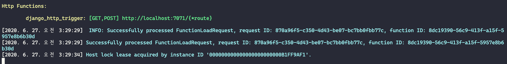

# Azure Functions 3.x에서 장고 프로젝트 구동하기

## 1) azure-functions-core-tools 설치

[공식문서](https://github.com/Azure/azure-functions-core-tools#installing) 참고

```sh
# 윈도우에서 choco 사용할 때 (추천)
choco install azure-functions-core-tools

# 맥에서 homebrew 사용할 때
brew tap azure/functions
brew install azure-functions-core-tools@3

# 윈도우에서 npm으로 설치할 때
npm i -g azure-functions-core-tools@3 --unsafe-perm true
```

## 2) 본 프로젝트 내에 .venv 가상환경 생성하고, 필요한 라이브러리 설치

파이썬 3.7 이상을 먼저 설치해주세요.

Azure Functions에서는 가상환경을 필수로 요구합니다. 그리고 그 가상환경은 프로젝트 내부에 위치해야만 합니다.

```sh
python -m venv .venv
source .venv/Scripts/activate  # 윈도우
# source .venv/bin/activate  # 맥/리눅스
```

라이브러리 설치 (`(.venv) $` 부분은 프롬프트입니다. `pip` 부터 입력하시면 됩니다.)

```sh
(.venv) $ pip install -r requirements.txt
```

## 3) 로컬에서 Azure Functions 서버 구동

```
func start
```

위 명령을 입력하고

> 주의: 관련 툴을 설치했는 데 찾을 수 없는 명령이라고 뜬다면 PATH 이슈일 가능성이 높습니다.




## 4) 웹서비스 접속

`http://localhost:7071`로 접속하여, 장고 시작페이지가 뜨면 성공~! :-)


---

관련 질문은 [Ask Company with Django/React 페이스북 그룹](https://www.facebook.com/groups/askdjango)에 해주세요. :-)
